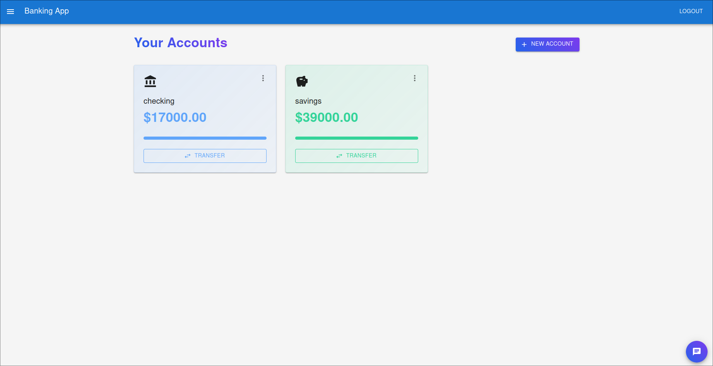

# Modern Banking Application

A full-stack banking application with features like account management, transactions, investments, loans, and a customer review system.

## Features

- 🔐 Secure user authentication
- 💳 Account management
- 💸 Money transfers
- 📊 Investment portfolio
- 💰 Loan applications
- 💬 Chatbot assistant
- ⭐ Customer reviews
- 📱 Responsive design

## Tech Stack

### Frontend
- React.js
- Material-UI
- Framer Motion
- Axios
- React Router

### Backend
- Node.js
- Express.js
- MySQL
- MongoDB Atlas (for reviews)
- JWT Authentication

## Setup Instructions

### Prerequisites
- Node.js (v14 or higher)
- MySQL
- MongoDB Atlas account
- npm or yarn

### Database Setup

1. Create a MySQL database named 'bankingsystem'
2. Run the SQL commands from `database_schema.sql`

### Backend Setup

1. Navigate to backend directory:
```bash
cd banking-backend
```

2. Install dependencies:
```bash
npm install
```

3. Create a `.env` file with the following variables:
```env
MONGODB_URI=your_mongodb_atlas_uri
JWT_SECRET=your_jwt_secret
```

4. Update MySQL connection in `server.js`:
```javascript
const db = mysql.createConnection({
  host: "localhost",
  user: "your_username",
  password: "your_password",
  database: "bankingsystem",
})
```

5. Install nodemon globally (optional, for development):
```bash
npm install -g nodemon
```

6. Start the backend server:

For development (with auto-reload):
```bash
nodemon server.js
```

Or for production:
```bash
node server.js
```

The backend server will run on `http://localhost:5000`

Note: Make sure your MySQL server is running and the database is created before starting the backend server.

7. Verify the server is running by checking:
- MySQL connection success message
- MongoDB Atlas connection success message
- Server running message on port 5000

### Frontend Setup

1. Navigate to frontend directory:

```bash
cd banking-frontend
```

2. Install dependencies:

```bash
npm install
```

3. Start the frontend application:

```bash
npm start
```

The application will be available at `http://localhost:3000`

## API Endpoints

### Authentication
- POST `/api/auth/register` - Register new user
- POST `/api/auth/login` - User login

### Accounts
- GET `/api/accounts/all` - Get all user accounts
- POST `/api/accounts/create` - Create new account
- GET `/api/accounts/balance` - Get account balance

### Transactions
- GET `/api/transactions` - Get user transactions
- POST `/api/transactions/create` - Create new transaction

### Investments
- GET `/api/investments` - Get user investments
- POST `/api/investments/create` - Create new investment
- POST `/api/investments/withdraw` - Withdraw from investment
- POST `/api/investments/add-funds` - Add funds to investment

### Loans
- GET `/api/loans` - Get user loans
- POST `/api/loans/apply` - Apply for new loan

### Reviews
- GET `/api/reviews` - Get customer reviews
- POST `/api/reviews` - Post new review

## Security Features

- JWT authentication
- Password hashing
- Protected routes
- SQL injection prevention
- Input validation
- Secure headers


## License

This project is licensed under the GNU Public License V3.0 - see the LICENSE file for details

## Screenshots





